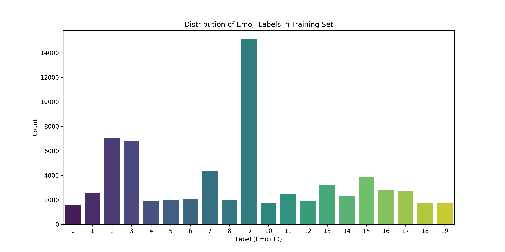
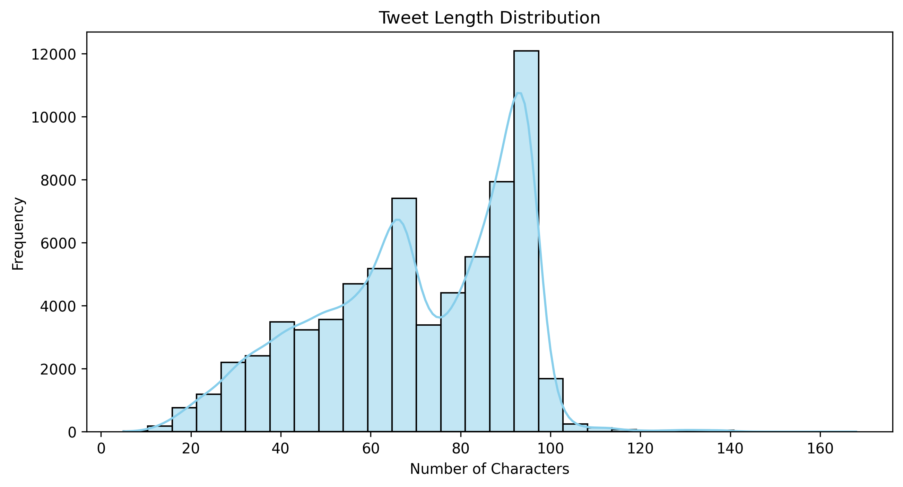
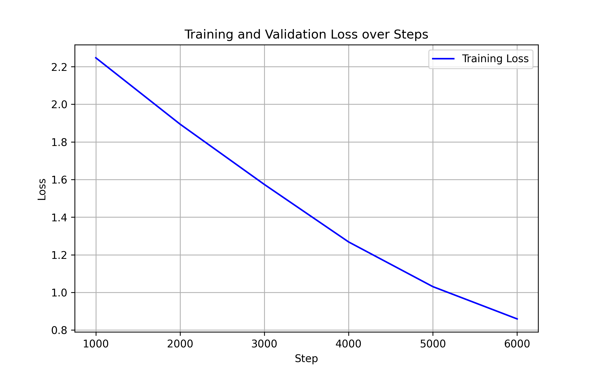
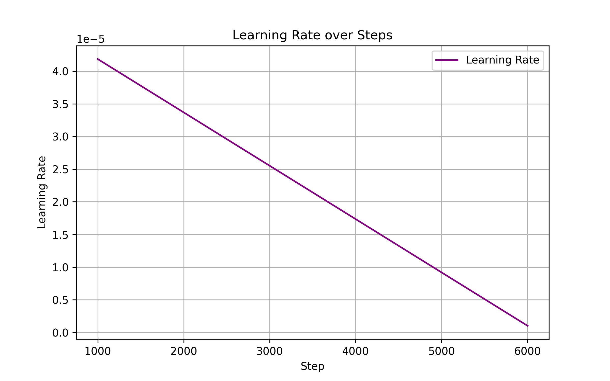
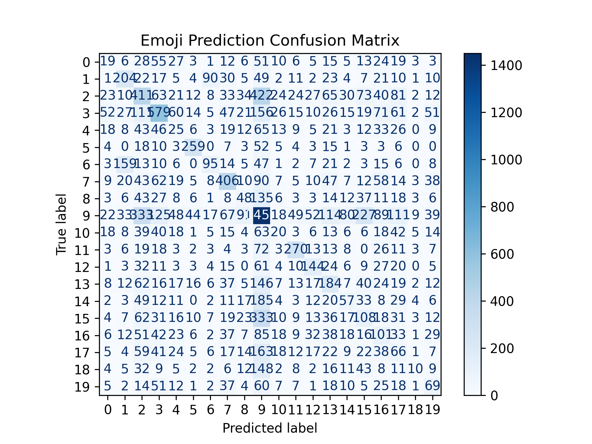

# Twitter Emoji Prediction using Transformers

This project focuses on **predicting emojis from tweet text** using a **Transformer-based deep learning model (DistilBERT)**.  
Given a tweet, the model learns contextual representations of text and predicts the most appropriate emoji.

---

## Project Overview

- **Task**: Multi-class emoji classification
- **Input**: Tweet text
- **Output**: One emoji per tweet
- **Model**: DistilBERT (`distilbert-base-uncased`)
- **Frameworks**: PyTorch, Hugging Face Transformers
- **Hardware**: GPU (Tesla P100)

---

## Dataset Attribution

This project uses the **Twitter Emoji Prediction** dataset provided on Kaggle by _hariharasudhanas_:

https://www.kaggle.com/datasets/hariharasudhanas/twitter-emoji-prediction

---

## Dataset Description

The dataset consists of tweets labeled with emojis.

### Files used:

- **Train.csv** – Tweet text with numeric emoji labels
- **Test.csv** – Tweet text without labels
- **Mapping.csv** – Mapping between numeric labels and emoji characters

---

## Exploratory Data Analysis (EDA)

### Class Distribution

This plot shows how emoji labels are distributed in the training dataset.



---

### Tweet Length Distribution

Understanding tweet length helps choose an appropriate maximum sequence length for the transformer.



---

## Model & Training

- **Tokenizer**: DistilBERT Tokenizer
- **Max Sequence Length**: 128 tokens
- **Epochs**: 7
- **Optimizer**: AdamW
- **Learning Rate**: 5e-5
- **Loss Function**: Cross Entropy Loss
- **Evaluation Metrics**:
  - Accuracy
  - Macro F1-score

---

## Training Curves

### Training & Validation Loss

The loss curve shows stable and consistent convergence during training.



---

### Learning Rate Schedule

Learning rate progression during training.



---

## Model Evaluation

### Confusion Matrix

The confusion matrix highlights which emojis are most commonly confused by the model.



---

## Inference & Predictions

- The trained model is used to generate predictions on the **test set**
- Numeric predictions are converted back to emojis using `Mapping.csv`
- Final predictions are saved as:

```
test_predictions.csv
```

---

## Key Learnings

- End-to-end Transformer fine-tuning
- GPU-based training and debugging
- NLP preprocessing for social media text
- Model evaluation and visualization
- Real-world inference pipeline

---

## Future Improvements

- Try larger transformer models (BERT, RoBERTa)
- Use class-weighted loss to address imbalance
- Top-k emoji prediction instead of single label
- Deploy as a Streamlit or Gradio web app

---

# IMPORTANT

Please only use this repo using git clone and not zip it directly because a main modle file "model.safetensors" is uploaded on git LFS which does not work with zipping the repo.
